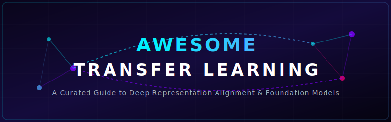
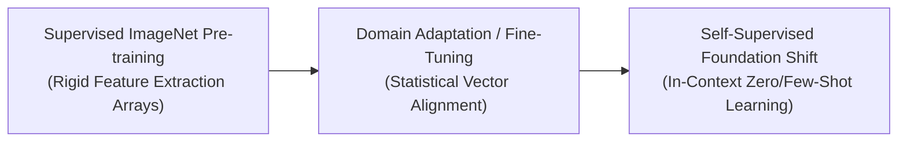

<!-- SEO Metadata -->
<!--
Description: A curated compilation of transfer learning evolution, core variants, parameter modification types, production engineering challenges, mitigations, and frontier applications.
Keywords: Transfer Learning, Domain Adaptation, PEFT, LoRA, Machine Learning, Deep Learning, Foundation Models, GPT-4, AlexNet, ULMFiT, Sim-to-Real
-->

# Awesome-Transfer-Learning 🚀

  

      

---

## 💡 Overview & Introduction

Transfer Learning is a foundational machine learning paradigm where a model developed for one primary task is repurposed as the starting point for a model on a second, related task. Instead of training a neural network from scratch (tabula rasa)—which demands vast computational budgets and millions of annotated data points—transfer learning exploits features, patterns, and representations already internalized by a source network. This optimization drastically accelerates convergence, improves generalization, and enables effective deep learning in low-data regimes.

---

## 📅 1. The Chronological Evolution

The implementation of transfer learning has shifted from basic cross-network weight initializations on small datasets to massive foundation models serving as universal downstream engines.

| Era / Concept | Description | Year First Used | Seminal Paper |
| :--- | :--- | :--- | :--- |
| [**The Supervised Computer Vision Era (~2012–2018)**](details/supervised_cv_era.md) | **Concept:** Popularized by architectures like AlexNet, VGG, and ResNet trained on the massive ImageNet dataset. The low-level convolutional weights (detecting edges, textures, and shapes) were frozen, while the final classification layer was chopped off and replaced for custom target domains.  **Limitation:** Bound heavily to supervised data; migrating across highly disparate modalities (e.g., from natural photography to medical X-rays) often suffered from negative transfer. | 2012 | [AlexNet (Krizhevsky et al.)](https://proceedings.neurips.cc/paper/2012/hash/c3982bc38a8dbd74b5cd367555ddad57-Abstract.html) |
| [**The Sequential NLP Pipeline Era (~2018–2022)**](details/sequential_nlp_era.md) | **Concept:** Unlocked in natural language processing by models like ULMFiT, BERT, and early GPT variants. Networks underwent massive self-supervised language modeling over massive text corpora before undergoing Task-Specific Fine-Tuning.  **Limitation:** Required updating all parameters for every unique downstream task, leading to high storage and deployment infrastructure overhead. | 2018 | [ULMFiT (Howard & Ruder)](https://arxiv.org/abs/1801.06146) |
| [**The Modern In-Context Foundation Era (~2023–Present)**](details/modern_in_context_era.md) | **Concept:** The current state-of-the-art paradigm. Multi-billion parameter frontier systems serve as universal token engines. Transfer learning no longer requires explicit architectural parameter modification; models execute tasks via **In-Context Learning (Zero-Shot/Few-Shot)** driven purely by contextual natural language prompting. | 2023 | [GPT-4 Technical Report (OpenAI)](https://arxiv.org/abs/2303.08774) |

---

## 🔄 2. Core Functional & Data Variants

Transfer learning configurations are strictly categorized based on the alignment and overlap between the Source and Target Data Domains ($D$) alongside their respective Tasks ($T$).

| Variant | Description | Year First Used | Seminal Paper |
| :--- | :--- | :--- | :--- |
| [**Inductive Transfer Learning**](details/inductive_transfer.md) | **Alignment:** The source and target domains are identical ($D_s = D_t$), but the target machine learning task is completely different ($T_s \neq T_t$).  **Example:** A model trained to read English text and classify its overall emotional sentiment is adapted to read English text and extract grammatical parts of speech. | 2010 | [Pan & Yang Survey](https://ieeexplore.ieee.org/document/5288526) |
| [**Transductive Transfer Learning (Domain Adaptation)**](details/transductive_transfer.md) | **Alignment:** The target task matches the source task exactly ($T_s = T_t$), but the underlying input data distribution shifts significantly ($D_s \neq D_t$).  **Example:** A computer vision model trained to execute object detection on clear, daytime high-resolution camera feeds is transferred to execute object detection on noisy, nighttime thermal imaging sensors. | 2010 | [Pan & Yang Survey](https://ieeexplore.ieee.org/document/5288526) |
| [**Unsupervised Transfer Learning**](details/unsupervised_transfer.md) | **Alignment:** Both the source data domain and target task are completely unaligned ($D_s \neq D_t, T_s \neq T_t$), and the system must discover structural clustering mappings entirely from uncurated data. | 2010 | [Pan & Yang Survey](https://ieeexplore.ieee.org/document/5288526) |

---

## 🏗️ 3. Structural Parameter Modification Types

Depending on the scale of your processing environment and memory storage budgets, transfer learning is executed through distinct structural layers.

| Type | Description | Year First Used | Seminal Paper |
| :--- | :--- | :--- | :--- |
| [**Feature Extraction (Frozen Backbone)**](details/feature_extraction.md) | **Mechanism:** The entire weight portfolio of the pre-trained source model is permanently locked and frozen. The model acts as a fixed mathematical feature converter. A tiny, shallow classification layer is appended to the tail end and trained on target inputs.  **Pros:** Computationally cheap; requires zero backpropagation calculations through the massive core network graph. | 2014 | [Yosinski et al.](https://arxiv.org/abs/1411.1792) |
| [**Full Fine-Tuning (End-to-End)**](details/full_fine_tuning.md) | **Mechanism:** Copies all weights from the pre-trained source network into a new workspace, but keeps all layers unlocked. The entire system undergoes backpropagation on the target data using a highly microscopic learning rate to prevent destroying the base patterns.  **Cons:** Susceptible to **Catastrophic Forgetting**, where the network erases its foundational general knowledge while over-fitting to the new task. | 2014 | [Yosinski et al.](https://arxiv.org/abs/1411.1792) |
| [**Parameter-Efficient Fine-Tuning (PEFT / LoRA)**](details/parameter_efficient_fine_tuning.md) | **Mechanism:** Freezes the base foundation network completely, but injects tiny, low-rank parameter adapters ($<1\%$ of total network size) inside specific hidden layers to track task adjustments.  **Status:** The dominant enterprise production standard for configuring open-weights models. | 2019 | [Houlsby et al.](https://arxiv.org/abs/1902.00751) / [LoRA (Hu et al.)](https://arxiv.org/abs/2106.09685) |

---

## ⚡ 4. Production Engineering Challenges & Mitigations

While transfer learning saves millions of dollars in compute capital, it introduces systemic data dependency anomalies if implemented blindly.

| Challenge | Description | Year Identified | Seminal Paper |
| :--- | :--- | :--- | :--- |
| [**The Negative Transfer Penalty**](details/negative_transfer.md) | **The Phenomenon:** Occurs when the knowledge learned from a source task actively degrades the performance of the model on the target task, usually because the two domains share zero underlying semantic correlation.  **Mitigation:** Calculating **Maximum Mean Discrepancy (MMD)** or utilizing attention-based mapping encoders to mathematically verify similarity scores before instantiating the transfer layer. | 2005 | [Rosenstein et al.](https://www.cs.utexas.edu/~mrosenst/papers/nips2005_transfer.pdf) |
| [**The Data Bias Cascade**](details/data_bias_cascade.md) | **The Phenomenon:** Massive foundation networks absorb structural biases, factual hallucinations, and cultural skewed values present in raw web crawls, automatically transferring those undesirable systemic behaviors down into specialized enterprise workflows.  **Mitigation:** Implementing rigorous post-transfer optimization algorithms like **Direct Preference Optimization (DPO)** or alignment filtering layers directly on the downstream outputs. | 2021 | [Stochastic Parrots (Bender et al.)](https://doi.org/10.1145/3442188.3445922) |

---

## 🚀 5. Frontier Real-World Applications

| Application | Description | Year First Used | Seminal Paper |
| :--- | :--- | :--- | :--- |
| [**Low-Resource Medical Diagnostic Classification**](details/medical_diagnostic_classification.md) | **Application:** Deep convolutional or vision transformer backbones pre-trained on generic datasets (like ImageNet) are transferred to analyze specialized clinical data (like MRI, CT, or optical coherence tomography scans). The model requires fewer than 50 patient samples to classify rare anomalies precisely. | 2017 | [Esteva et al.](https://doi.org/10.1038/nature21056) |
| [**Enterprise Language Customization & Localization**](details/enterprise_language_customization.md) | **Application:** Multilingual base foundation networks undergo transfer learning via parameter adapters (LoRA) on hyper-specific corporate data (such as internal legal terms, aerospace schematics, or regional dialects), inheriting specialized vocabulary without requiring full pre-training iterations. | 2020 | [MAD-X (Pfeiffer et al.)](https://arxiv.org/abs/2005.00052) |
| [**Cross-Domain Robotic Policy Adaptation**](details/robotic_policy_adaptation.md) | **Application:** Autonomous manipulation and navigation models are trained within rich, high-throughput physics simulators (Sim-to-Real transfer). The learned geometric policies and physical kinetic parameters are then transferred onto tangible, physical robotic limbs operating inside dynamic factory workspaces. | 2017 | [Domain Randomization (Tobin et al.)](https://arxiv.org/abs/1703.06907) |
