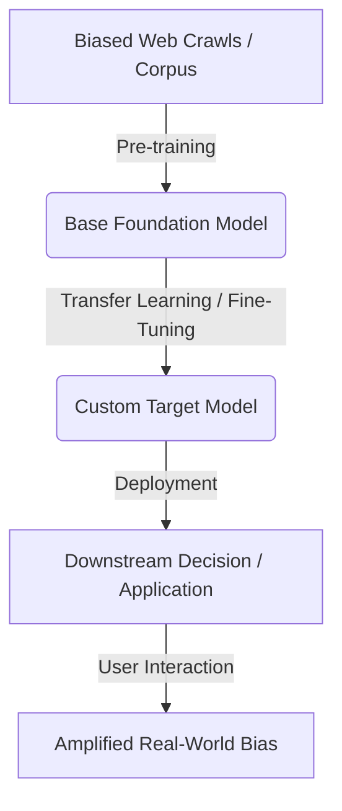

# The Data Bias Cascade 🌊

## Overview
The Data Bias Cascade refers to the phenomenon where pre-trained foundation models absorb societal biases, stereotypes, and factual inaccuracies present in massive, uncurated internet-scale datasets (like web crawls). When these foundation models are transferred or fine-tuned for downstream workflows, they pass down and amplify these undesirable behaviors.

## Core Concept
Biases propagate and compound throughout the model development lifecycle. What begins as representation bias in the training corpus becomes algorithmic bias in the foundation model, and ultimately manifests as discriminatory decisions or harmful outputs in downstream enterprise systems.

## Seminal Paper
* **Paper**: [On the Dangers of Stochastic Parrots: Can Language Models Be Too Big? (Bender et al., 2021)](https://doi.org/10.1145/3442188.3445922)
