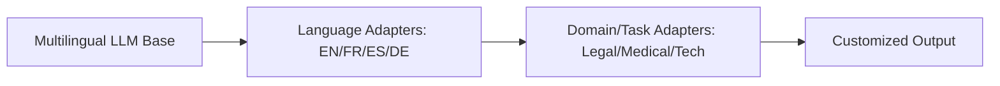

# Enterprise Language Customization & Localization 🏢

## Overview
Enterprise Language Customization and Localization refers to adapting massive, general-purpose multilingual language models to specific languages, regional dialects, or domain-specific terminologies (such as legal jargon, medical records, or proprietary engineering schematics). This is accomplished via parameter adapters (like LoRA or MAD-X) to avoid full model retrainings.

## Core Concept
Instead of training a separate base model for each dialect or enterprise domain, modular adapter layers are inserted. For localization, language-specific adapters learn the syntactic mapping of a target language, while task-specific adapters learn task performance (e.g., sentiment extraction). These can be dynamically swapped.

## Seminal Paper
* **Paper**: [MAD-X: An Adapter-Based Framework for Multi-Task Cross-Lingual Transfer (Pfeiffer et al., 2020)](https://arxiv.org/abs/2005.00052)
