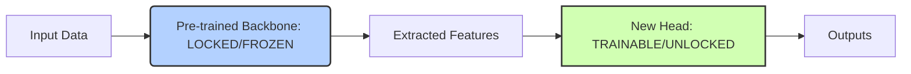

# Feature Extraction (Frozen Backbone) ❄️

## Overview
Feature Extraction is a transfer learning strategy where the entire weights portfolio of the pre-trained source model is permanently locked and frozen. The model acts as a fixed mathematical feature converter. A tiny, shallow classification layer (head) is appended to the tail end of the network and trained on the target inputs.

## Core Concept
By locking the base backbone, the model uses features learned during pre-training (like shapes, textures, or syntactic patterns) without modifying them. This is highly efficient because:
* It requires zero backpropagation calculations through the massive core network graph.
* It completely eliminates the risk of modifying the base model's general capabilities.
* It is extremely fast to train since only the final layer's parameters are updated.

## Seminal Paper
* **Paper**: [How transferable are features in deep neural networks? (Yosinski et al., 2014)](https://arxiv.org/abs/1411.1792)
