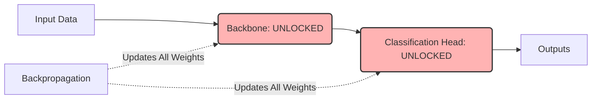

# Full Fine-Tuning (End-to-End) 🔥

## Overview
Full Fine-Tuning is a transfer learning strategy where all layers of a pre-trained network are unlocked and updated during training on the target task. Instead of keeping the backbone frozen, the entire model undergoes end-to-end backpropagation.

## Core Concept
All weights from the pre-trained source model are copied and acts as initializations for the target model. The model is then trained on target domain data. To prevent erasing the pre-trained features (a phenomenon known as **Catastrophic Forgetting**), practitioners use a highly microscopic learning rate (e.g., $10^{-5}$ or $10^{-6}$) and sometimes employ learning rate discriminators (smaller rates for early layers, larger rates for later layers).

## Seminal Paper
* **Paper**: [How transferable are features in deep neural networks? (Yosinski et al., 2014)](https://arxiv.org/abs/1411.1792)
