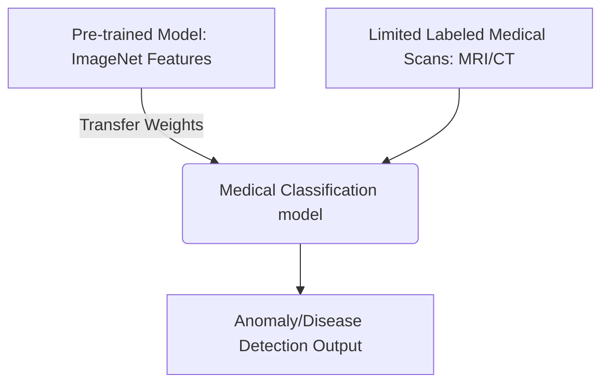

# Low-Resource Medical Diagnostic Classification 🩺

## Overview
Low-Resource Medical Diagnostic Classification is a key application of transfer learning where deep models pre-trained on generic datasets (such as ImageNet) are repurposed to classify rare medical anomalies (like MRI, CT, or optical coherence tomography scans). Because collecting labeled medical data is extremely expensive and limited due to privacy concerns, transfer learning is crucial.

## Core Concept
Medical images often contain fine-grained, localized details (like textures or lesions) rather than the global objects found in natural photography. By transferring representations from a pre-trained CNN or Vision Transformer (ViT) backbone, the model requires very few annotated patient samples (often fewer than 50) to achieve high diagnostic accuracy.

## Seminal Paper
* **Paper**: [Dermatologist-level classification of skin cancer with deep neural networks (Esteva et al., 2017)](https://doi.org/10.1038/nature21056)
