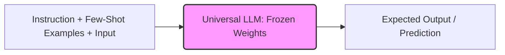

# The Modern In-Context Foundation Era (~2023–Present) 🤖

## Overview
The modern foundation model era represents a shift from model fine-tuning to prompt-based adaptation. Multi-billion parameter models function as general-purpose reasoners. Instead of modifying model weights, transfer learning is achieved via **In-Context Learning (ICL)**, where the model infers the task from context clues, instruction descriptions, and few-shot examples.

## Core Concept
In-context learning processes the input prompt as a task specification:
* **Zero-Shot Learning**: Providing only the instruction description.
* **Few-Shot Learning**: Providing the instruction alongside a small set of input-output demonstrations.
* **No Weight Updates**: The model parameters remain entirely frozen; knowledge transfer occurs purely during the forward pass.

## Seminal Paper
* **Paper**: [GPT-4 Technical Report (OpenAI, 2023)](https://arxiv.org/abs/2303.08774)
