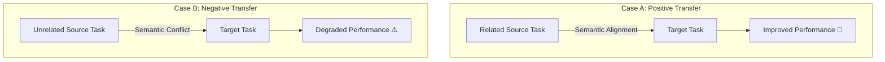

# The Negative Transfer Penalty ⚠️

## Overview
Negative Transfer occurs when the knowledge learned from a source task or domain actively degrades the performance of the model on the target task. It is the primary failure mode of transfer learning and typically happens when the source and target tasks/domains share little to no underlying semantic or structural correlation.

## Core Concept
In machine learning, transfer learning relies on the assumption that the source and target tasks share features or structures. When this assumption is violated, the model transfers inappropriate inductive biases, leading to worse performance than training from scratch (tabula rasa).

### Mitigations
To avoid negative transfer, practitioners compute similarity metrics between domains:
1. **Maximum Mean Discrepancy (MMD)**: A distance metric between probability distributions in a reproducing kernel Hilbert space.
2. **Adversarial Domain Classification**: Training an adversarial classifier to distinguish source from target features; if the classifier cannot distinguish them, domain gap is small.

## Seminal Paper
* **Paper**: [To Transfer or Not to Transfer (Rosenstein et al., 2005)](https://www.cs.utexas.edu/~mrosenst/papers/nips2005_transfer.pdf)
