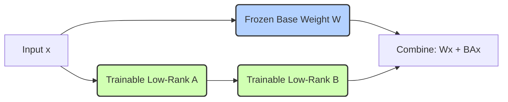

# Parameter-Efficient Fine-Tuning (PEFT / LoRA) ⚡

## Overview
Parameter-Efficient Fine-Tuning (PEFT) is a collection of techniques designed to adapt large pre-trained foundation models to downstream tasks without updating all model parameters. The most popular method, **LoRA (Low-Rank Adaptation)**, freezes the base model weights completely and injects tiny, trainable rank-decomposition matrices into the model's layers.

## Core Concept
In standard fine-tuning, we modify the weight matrix $W$ by adding a delta $\Delta W$ (so $W_{new} = W + \Delta W$). Since $W$ is massive, computing and storing $\Delta W$ is extremely expensive. 

LoRA parameterizes $\Delta W$ as the product of two low-rank matrices $A$ and $B$:
$$\Delta W = B \times A$$
where $B \in \mathbb{R}^{d \times r}$ and $A \in \mathbb{R}^{r \times k}$ with rank $r \ll \min(d, k)$. Only $A$ and $B$ are updated, reducing the number of trainable parameters by up to 99.9%.

## Seminal Papers
* **PEFT/Adapters**: [Parameter-Efficient Transfer Learning for NLP (Houlsby et al., 2019)](https://arxiv.org/abs/1902.00751)
* **LoRA**: [LoRA: Low-Rank Adaptation of Large Language Models (Hu et al., 2021)](https://arxiv.org/abs/2106.09685)
