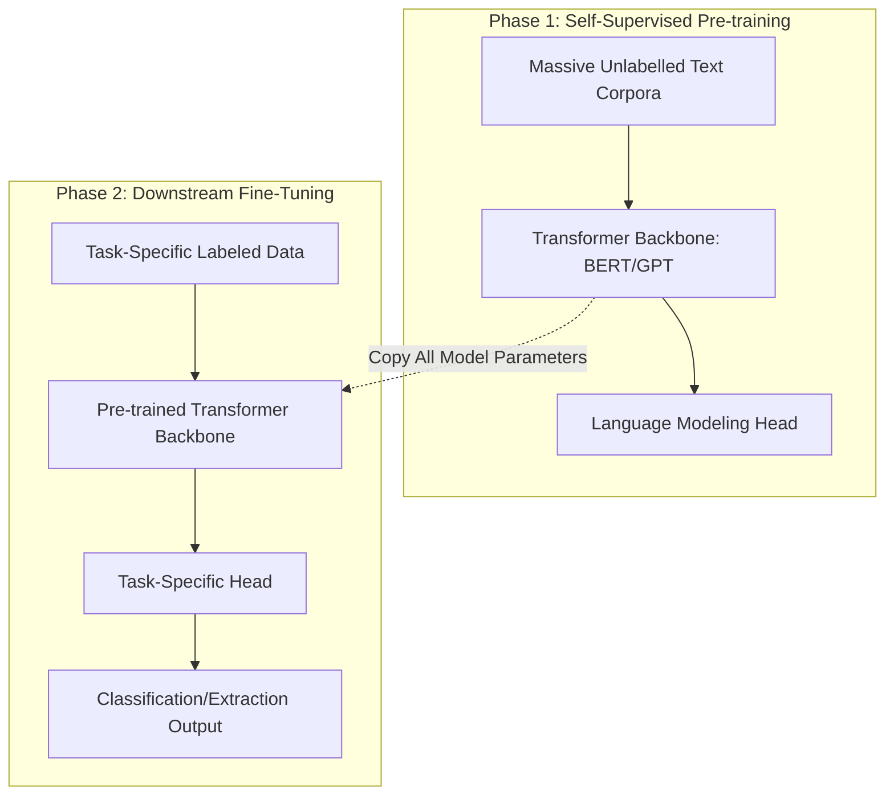

# The Sequential NLP Pipeline Era (~2018–2022) 📝

## Overview
Before 2018, natural language processing (NLP) relied heavily on word embeddings (Word2Vec, GloVe), which were static and could not capture contextual meaning. The sequential NLP pipeline era introduced self-supervised pre-training on massive unlabelled text corpora followed by supervised fine-tuning on downstream tasks, allowing models to grasp syntax, grammar, and context.

## Core Concept
Models are trained in two distinct sequential phases:
1. **Self-Supervised Pre-training**: Learning language structures via objectives like Masked Language Modeling (BERT) or Autoregressive Language Modeling (GPT) on massive corpora.
2. **Supervised Fine-Tuning**: Adapting all the model parameters to a specific downstream task (e.g., text classification, question answering) using labeled data.

## Seminal Paper
* **Paper**: [Universal Language Model Fine-tuning for Text Classification (Howard & Ruder, 2018)](https://arxiv.org/abs/1801.06146)
