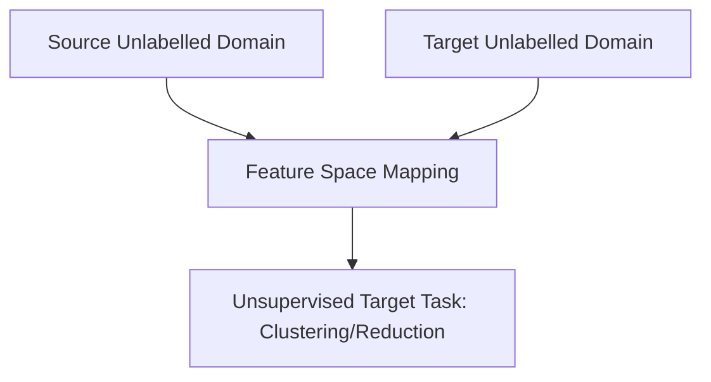

# Unsupervised Transfer Learning 🧬

## Overview
Unsupervised Transfer Learning is a setting where both the source and target tasks are different ($T_s \neq T_t$) and the source and target domains are different ($D_s \neq D_t$), but crucially, no labeled data is available in either domain. The objective is to discover latent structural representations or clustering mappings that can be transferred across tasks.

## Core Concept
Because there are no label maps or targets, the system must learn shared representation spaces or feature manifolds entirely from uncurated data. This is typically used for unsupervised tasks like:
* Unsupervised Clustering
* Dimensionality Reduction / Manifold Learning
* Unsupervised Representation Alignment

## Seminal Paper
* **Paper**: [A Survey on Transfer Learning (Pan & Yang, 2010)](https://ieeexplore.ieee.org/document/5288526)
